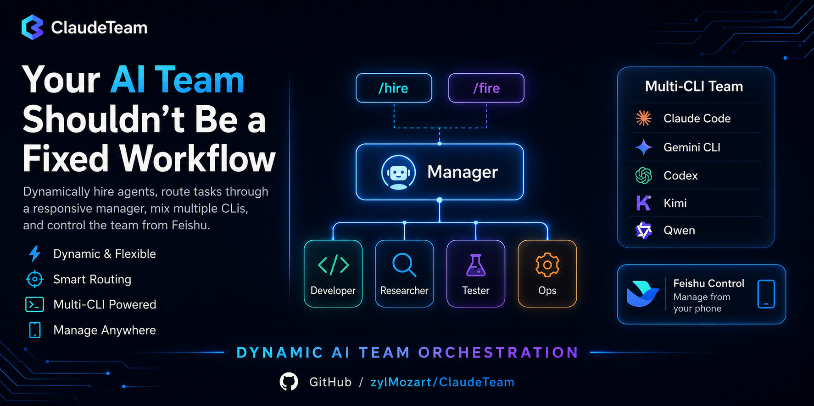

<p align="center">
  
</p>

<p align="center">
  <a href="LICENSE"></a>
  
  
  <a href="docs/DEPLOYMENT.md"></a>
  
</p>

<p align="center">
  <b>Hire & fire AI agents on demand · mix CLIs · manage from your phone via Feishu.</b>
</p>

<p align="center">
  Multiple coding agents running in tmux, coordinated through a Feishu group chat. The boss talks to a <b>manager</b> agent; the manager dispatches workers, watches their panes, and summarises back. Everything is auditable on disk; nothing depends on a remote DB.
</p>

> **One-click deploy — paste this prompt to your coding agent
> (Claude Code, Codex, Kimi, Gemini, Qwen, …):**
>
> ```
> Clone https://github.com/zylMozart/ClaudeTeam.git, read
> docs/DEPLOYMENT.md, then walk me through bringing up a team
> end-to-end (including the Feishu app if I don't have one yet).
> ```

**Feishu group chat — control your AI team in real time**

<table><tr>
<td></td>
<td></td>
<td></td>
<td></td>
<td></td>
</tr></table>

**tmux backend — Claude Code agents running in parallel**

<p></p>

---

## What it does

```
You (Feishu group chat)
  ↕  WebSocket
Router (long-poll subscribe → classify → deliver)
  ↕
┌──────────┬──────────┬──────────┐
│ manager  │ worker_X │ worker_Y │  ← tmux windows running Claude Code / Codex / Kimi / ...
│(routes)  │(executes)│(executes)│
└──────────┴──────────┴──────────┘
  ↕
Local store (inbox / status / logs / tasks / durable memory)
```

The boss talks to **manager** in the group chat. Manager dispatches work
to workers, watches their tmux panes, summarises back to the group.
Workers say-back when they finish. Everything is auditable on disk;
nothing depends on a remote DB.

---

## Features

- **Single-interface routing** — every group message goes to the
  manager only; workers never get raw boss messages. Manager is the
  sole orchestrator.
- **One config file** — `claudeteam.toml` (Cargo-style, comment-friendly)
  — chat_id, agents, models, card colors, publish filters, all in
  one place.
- **`[chat.publish]` filter** — sender→receiver visibility per channel.
  Silence noisy traffic without losing the audit log.
- **Multi-CLI** — Claude Code, Codex CLI, Kimi Code, Gemini CLI,
  Qwen Code can all run in the same team.
- **Durable memory** — agent memory survives `/clear` and pane respawn,
  auto-injected into the wake prompt.
- **Watchdog** — crashed daemons respawn with cooldown + Feishu chat
  alert when cooldown trips.
- **Slash commands from chat** — `/help /team /health /usage /tmux
  /send /compact /clear /stop /peek /say /remember /recall`.
- **Zero Python dependencies** — runs on the standard library only;
  the only external runtime is `lark-cli` (Node).

---

## Prerequisites

| Need | Version | Why |
| ---- | ------- | --- |
| Python | 3.10+ | `pyproject.toml` pins it |
| tmux | any | one window per agent |
| Node + npx | 18+ | `lark-cli` is a node binary |
| At least one CLI | latest | `claude` / `codex` / `kimi` / `gemini` / `qwen` |
| Feishu enterprise | — | custom app with `im:message` + WebSocket subscription |

For Docker: just Docker 20.10+ and Compose v2 (CLIs come with the
container or via bind-mount).

---

## Quick start

> **First**: create a Feishu app + add the bot to your group
> ([see below](#feishu-bot-setup)). You'll need the `App ID`,
> `App Secret`, and the `chat_id` of the group the bot is in.

```bash
git clone https://github.com/zylMozart/ClaudeTeam.git
cd ClaudeTeam

# Shell env (per terminal — add to ~/.zshrc to persist)
export CLAUDETEAM_STATE_DIR="$PWD/state"
export LARK_CLI_NO_PROXY=1
export CLAUDETEAM_LARK_SEND_AS=bot

# Install
python3 -m venv .venv && source .venv/bin/activate
pip install -e .

# Config
claudeteam init                  # writes claudeteam.toml
$EDITOR claudeteam.toml          # set chat_id + agents
claudeteam install-hooks         # claude-code slash commands

# Launch
claudeteam up                    # tmux + agents + router + watchdog
claudeteam health                # green/yellow/red snapshot
```

Chat with the team in your Feishu group. Manager handles dispatch.

For detailed setup, Docker, multi-team isolation, and troubleshooting
see **[docs/DEPLOYMENT.md](docs/DEPLOYMENT.md)**.

---

## Multi-CLI adapter

Different agents can run different CLIs in the same team:

| Adapter | Identifier | Install |
| ------- | ---------- | ------- |
| Claude Code | `claude-code` (default) | `npm i -g @anthropic-ai/claude-code` |
| Codex CLI | `codex-cli` | `npm i -g @openai/codex` |
| Kimi Code | `kimi-code` | `uv tool install kimi-cli` |
| Gemini CLI | `gemini-cli` | `npm i -g @google/gemini-cli` |
| Qwen Code | `qwen-code` | `npm i -g qwen-code` |

In `claudeteam.toml`:

```toml
[team.agents.manager]
cli = "claude-code"
model = "opus"
role = "团队主管"

[team.agents.worker_codex]
cli = "codex-cli"
role = "数据分析员工"

[team.agents.worker_kimi]
cli = "kimi-code"
role = "策划员工"
```

---

## Feishu bot setup

ClaudeTeam needs a Feishu enterprise custom app (bot) with the right
permissions, event subscriptions, and callbacks. Two ways to set it up:

### Automated (recommended)

The bundled Playwright script creates and fully configures a Feishu
bot — app creation, bot capability, ~480 permission scopes, event
subscriptions (persistent connection + message events), card
callbacks, and version publishing. It runs in two modes:

```bash
cd scripts/feishu_bot_creator
npm install               # also installs playwright chromium (postinstall)

# One-time login (scan QR code with Feishu mobile)
node create_feishu_bot.js login
```

**Drive mode (recommended for agents)** — `drive` is the single
entry point: it opens chromium **once**, asks the user to scan QR if
no saved cookies, then runs the first incomplete stage and blocks
waiting for the next agent command. Browser stays open across all 7
stages.

```bash
# Start drive in the background. If first run, user scans QR (~30 s);
# cookies persist so subsequent drives skip this.
node create_feishu_bot.js drive my-bot "My ClaudeTeam bot" \
  > /tmp/drive.log 2>&1 &

# Agent watches /tmp/drive.log + .state/my-bot.json. After each
# stage settles, agent advances by writing one of:
echo next             > scripts/feishu_bot_creator/.state/my-bot.cmd
echo skip             > scripts/feishu_bot_creator/.state/my-bot.cmd
echo "redo events"    > scripts/feishu_bot_creator/.state/my-bot.cmd
echo quit             > scripts/feishu_bot_creator/.state/my-bot.cmd
```

Command meanings:
- `next` — run the next incomplete stage (happy path)
- `skip` — agent finished the current failed stage **manually in the
  open browser**; mark it done and move on (key escape hatch when
  Feishu UI changes break a Playwright selector)
- `redo <stage-id>` — un-mark that stage so the next iteration re-runs it
- `quit` — close browser and exit

Stages: `create-app → add-bot → import-scopes → data-range → events
→ callbacks → publish`. Each one is described in
[`docs/setup_feishu_bot.md`](docs/setup_feishu_bot.md) — what
Playwright does, the equivalent manual UI steps, and how to recover
if a stage fails.

**Unattended mode** — runs all 7 stages straight through without
agent involvement. Use only when you trust the selectors fully
(e.g. recreating a known-good bot, or batching across many test apps):

```bash
node create_feishu_bot.js create my-bot "My ClaudeTeam bot"
node create_feishu_bot.js batch bots.json     # [{name, description}, ...]
```

When done, paste the `App ID` + `App Secret` into your `.env` (Docker)
or `claudeteam.toml`, plus the `chat_id` of the group the bot was
added to.

### Manual

Two flavours, pick whichever you prefer:

- [`docs/setup_feishu_bot.md`](docs/setup_feishu_bot.md) — text walkthrough,
  same 7 stages as the auto-creator, easy to skim.
- [`docs/setup_feishu_bots_guide.pdf`](docs/setup_feishu_bots_guide.pdf) —
  screenshot-heavy click-by-click guide for human operators (great if
  it's your first time touching the Feishu open platform).

---

## Documentation

| Doc | What's in it |
| --- | ------------ |
| [`docs/DEPLOYMENT.md`](docs/DEPLOYMENT.md) | Host + Docker setup, config schema, multi-team isolation, troubleshooting |
| [`docs/setup_feishu_bot.md`](docs/setup_feishu_bot.md) | Feishu bot creation — text walkthrough (same 7 stages as the auto-creator) |
| [`docs/setup_feishu_bots_guide.pdf`](docs/setup_feishu_bots_guide.pdf) | Feishu bot creation — screenshot-heavy guide for human operators |
| [`CLAUDE.md`](CLAUDE.md) | Building rules — read before changing code |

---

## FAQ

**Q: Does it work with non-Anthropic models?**
A: Yes — the multi-CLI adapter table above shows the supported CLIs.
Each agent picks one in `claudeteam.toml`.

**Q: Can I use Slack / Discord instead of Feishu?**
A: Not out of the box. The chat layer is Feishu-specific
(`src/claudeteam/feishu/`).

**Q: How many agents can I run?**
A: Tested up to 5. Each Claude Code pane uses ~200-400 MB; 8 GB host
RAM is comfortable for 5.

**Q: An agent crashed — do I lose context?**
A: No. Inbox + status + logs + durable memory live on disk. Watchdog
respawns the daemon; `claudeteam reidentify <agent>` re-injects the
identity prompt with prior memory pre-loaded.

**Q: How much does it cost?**
A: ClaudeTeam is MIT-licensed and free. Costs come from your CLI's
API usage. Feishu free tier and `lark-cli` are free.

---

## Contributing

PRs welcome. See [`CLAUDE.md`](CLAUDE.md) for the building rules; for
substantial changes please open an issue first to discuss the design.

## License

[MIT](LICENSE)
