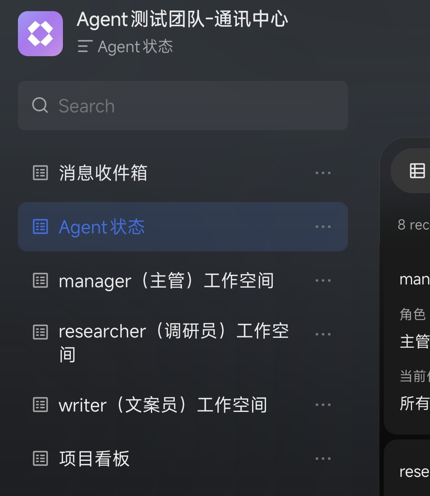
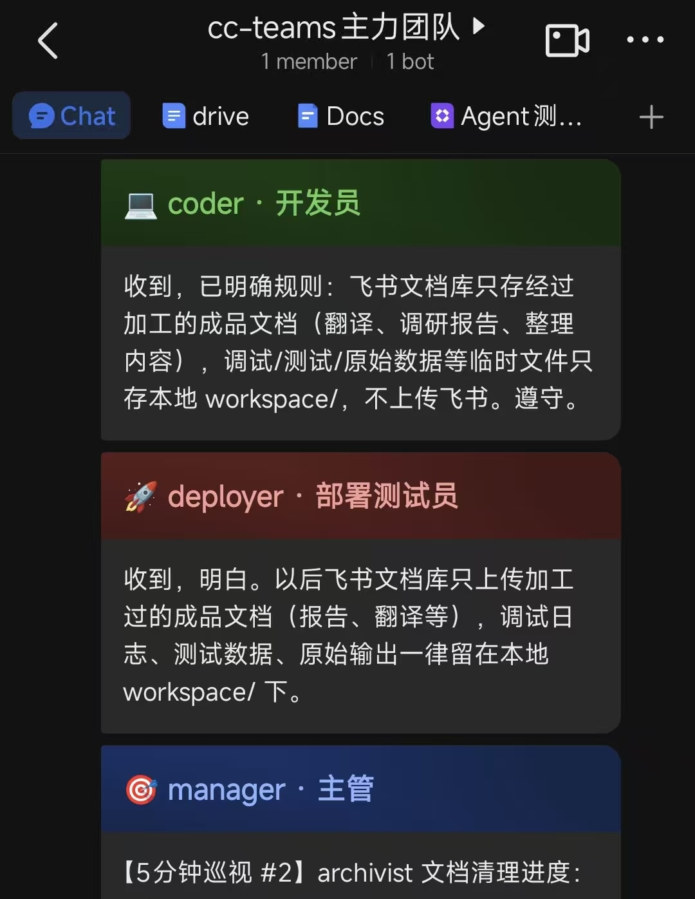

# ClaudeTeam

[中文](docs/README_CN.md) | [English](README.md)

> *Harness your Claude Code*

Your Claude Code agent keeps polluting its own context. Fix A, break B. Fix B, break A.

You don't need a smarter agent. You need a Harness — isolated agents, parallel execution, zero cross-contamination.

**ClaudeTeam: your first Harness.** One repo, multiple Claude Code agents, coordinated through Feishu.

*2025, Prompt Engineering. 2026, Harness Engineering.*

### Screenshots

**Feishu Group Chat — Control your AI team in real-time**

<table>
  <tr>
    <td></td>
    <td></td>
    <td></td>
    <td></td>
    <td></td>
  </tr>
</table>

**tmux Backend — Claude Code agents running in parallel**

<p></p>

---

## What It Does

ClaudeTeam turns Claude Code into a multi-agent system. Each agent runs in its own tmux window, has its own identity and memory, and communicates with teammates through a Feishu group chat. A manager agent coordinates the team, assigns tasks, reviews output, and reports to you.

**How it works:**

```
You (Feishu group chat)
  ↕
Router (real-time WebSocket events from Feishu)
  ↕
┌──────────┬──────────┬──────────┐
│ Manager  │ Agent A  │ Agent B  │  ← tmux windows, each running Claude Code
│(assigns) │(executes)│(executes)│     (you define the roles)
└──────────┴──────────┴──────────┘
  ↕
Feishu Bitable (message storage, status board, kanban)
```

You talk to the team in a Feishu group. The manager distributes work. Agents execute, collaborate, and report back. All messages are logged in Feishu Bitable for full traceability.

---

## Features

- **One-command setup** — Clone, run `setup.py`, Claude Code auto-guides configuration
- **Real-time collaboration** — Agents communicate through Feishu group chat with colored message cards
- **Autonomous agents** — Each agent has its own identity, memory, workspace, and task queue
- **Team management** — `/hire` and `/fire` slash commands to add or remove agents on the fly
- **Watchdog** — Crashed agents auto-restart, with notifications
- **Kanban board** — Task status synced to Feishu Bitable in real-time
- **Extensible** — Add any role you need: architect, tester, researcher, ops, educator...

---

## Prerequisites


| Requirement     | Version    | Check                                    |
| --------------- | ---------- | ---------------------------------------- |
| macOS or Linux  | —          | —                                        |
| Python          | 3.8+       | `python3 --version`                      |
| Node.js         | 18+        | `node --version`                         |
| tmux            | any        | `tmux -V`                                |
| Claude Code CLI | latest     | `claude --version`                       |
| lark-cli        | latest     | `npx @larksuite/cli --version`           |
| Feishu account  | Enterprise | [open.feishu.cn](https://open.feishu.cn) |


Install Claude Code if you haven't:

```bash
npm install -g @anthropic-ai/claude-code
```

---

## Quick Start (30 Seconds)

```bash
git clone https://github.com/zylMozart/ClaudeTeam.git
cd ClaudeTeam
claude
```

That's it. The setup generates `CLAUDE.md` automatically, which Claude Code reads on startup:

1. **Feishu credentials** — Create an app on Feishu Open Platform, paste your App ID and Secret
2. **Team design** — Define your team roles (manager + whatever you need)
3. **Auto-setup** — Creates Feishu group, Bitable tables, agent directories
4. **Launch** — Starts all agents in tmux, begins operation

The whole process takes about 5 minutes, most of which is creating the Feishu app.

---

## Manual Setup (If You Prefer)

Click to expand manual setup steps

### 1. Configure Feishu App

```bash
# Use lark-cli to configure Feishu app credentials (interactive)
npx @larksuite/cli config init
```

**Getting Feishu credentials:**

1. Visit [Feishu Open Platform](https://open.feishu.cn) → Developer Console
2. Create a Custom App (企业自建应用)
3. Copy App ID and App Secret from Credentials page
4. Add required permissions (see `config/feishu_scopes.json`):
  - `bitable:app` (Bitable read/write)
  - `base:app:create` (Create Bitable apps)
  - `im:chat` (Chat management)
  - `im:message` (Send & receive messages)
  - `im:message:receive_as_bot` (Receive message events)
  - `im:resource` (Upload & download files)
5. Event subscription: enable "Long connection" mode, add `im.message.receive_v1`
6. Publish the app

### 2. Define Your Team

Create `team.json` in the project root. Every team must include a `manager`; add any other roles you need. See `templates/` for identity templates.

```json
{
  "session": "my-team",
  "agents": {
    "manager": {"role": "主管", "emoji": "🎯", "color": "blue"}
  }
}
```

### 3. Install Dependencies and Initialize

```bash
npm install -g @larksuite/cli    # lark-cli (Feishu API operations)
python3 scripts/setup.py
```

### 4. Launch

```bash
bash scripts/start-team.sh
```


---

## Usage

### Talking to Your Team

Send messages in the Feishu group chat. The manager agent reads them and distributes work. You can @mention specific agents to talk to them directly.

### Viewing the Team

```bash
# Attach to the tmux session
tmux attach -t <session-name>

# Navigate between agent windows
Ctrl+B, n     # next window
Ctrl+B, p     # previous window
Ctrl+B, 0-9   # jump to window by number

# Detach (leave running in background)
Ctrl+B, d
```

### Managing Agents

From within Claude Code (as manager):

```
/hire <role-name> "<role-description>"
/fire <role-name>
```

### Communication Commands

All agents use `feishu_msg.py` for communication:

```bash
# Send direct message
python3 scripts/feishu_msg.py send <to> <from> "<message>" [高|中|低]

# Post to group chat
python3 scripts/feishu_msg.py say <name> "<message>"

# Check inbox
python3 scripts/feishu_msg.py inbox <name>

# Update status
python3 scripts/feishu_msg.py status <name> <状态> "<description>"

# Log work
python3 scripts/feishu_msg.py log <name> 任务日志 "<what you did>"
```

---

## Team Customization

Every team must include a **manager** agent. Beyond that, you define whatever roles your project needs — there are no fixed templates. During the guided setup, Claude will ask you what roles to create.

Use `/hire` and `/fire` to add or remove agents at any time. See `templates/` for the identity templates used when creating new agents.

---

## Project Structure

```
ClaudeTeam/
├── README.md                  # Chinese documentation (main)
├── LICENSE                    # MIT
│
├── docs/                      # Documentation
│   ├── POLICY.md              # Team communication rules
│   ├── README_EN.md           # This file (English documentation)
│   └── CONTRIBUTING.md        # Contribution guidelines
│
├── scripts/                   # Runtime scripts
│   ├── config.py              # Configuration loader
│   ├── setup.py               # One-time initialization (lark-cli)
│   ├── start-team.sh          # Team launcher
│   ├── feishu_msg.py          # Message bus (lark-cli wrapper)
│   ├── feishu_router.py       # Message router (lark-cli WebSocket events)
│   ├── msg_queue.py           # Message delivery queue
│   ├── tmux_utils.py          # tmux utilities
│   ├── hire_agent.py          # Agent creation helper
│   ├── fire_agent.py          # Agent removal helper
│   ├── watchdog.py            # Process monitor
│   ├── memory_manager.py      # Agent memory management
│   ├── kanban_sync.py         # Kanban board sync (lark-cli)
│   ├── task_tracker.py        # Task tracking system
│   └── feishu_sync.py         # File sync to Feishu Docs (lark-cli, optional)
│
├── templates/                 # Identity templates
│   ├── manager.identity.md    # Manager role template
│   └── worker.identity.md     # Generic worker template
│
└── .claude/skills/            # Slash commands
    ├── hire/SKILL.md           # /hire command
    └── fire/SKILL.md           # /fire command
```

**Runtime-generated (gitignored):** `team.json`, `CLAUDE.md`, `agents/`, `workspace/`, `scripts/runtime_config.json`

---

## How It Works (Architecture)

### Message Flow

1. **User** posts in Feishu group chat
2. **Router** (`feishu_router.py`) receives events in real-time via lark-cli WebSocket
3. Router parses @mentions and injects the message into the target agent's tmux window
4. **Agent** (Claude Code) processes the message, executes tasks
5. Agent uses `feishu_msg.py` to respond — message appears in Feishu group + Bitable

### Infrastructure


| Component     | Script             | Purpose                                              |
| ------------- | ------------------ | ---------------------------------------------------- |
| Message Bus   | `feishu_msg.py`    | Send/receive messages, update status, log work (lark-cli) |
| Router        | `feishu_router.py` | lark-cli WebSocket events → deliver to agents via tmux    |
| Message Queue | `msg_queue.py`     | FIFO queue for pending message delivery              |
| Watchdog      | `watchdog.py`      | Monitor processes, auto-restart on failure            |
| Kanban        | `kanban_sync.py`   | Sync task status to Feishu Bitable (lark-cli)        |
| lark-cli      | `@larksuite/cli`   | Feishu API operations (auth, messaging, bitable)     |


### Agent Lifecycle

```
/hire → create directory → generate identity.md → create Bitable table
     → open tmux window → start Claude Code → send init message
     → agent reads identity → checks inbox → starts working

/fire → archive workspace → close tmux window → remove from team.json
     → clean up Bitable resources
```

---

## FAQ

**Q: Does this work with other LLMs?**
A: Currently ClaudeTeam is built specifically for Claude Code. The agent harness (tmux management, message routing, identity system) could theoretically work with other CLI-based LLM tools, but this hasn't been tested.

**Q: Can I use Slack/Discord instead of Feishu?**
A: Not out of the box. The messaging layer (`feishu_msg.py`) is Feishu-specific. You'd need to rewrite the message bus and router for another platform.

**Q: How many agents can I run?**
A: Tested with up to 10 agents on a single machine. Each agent is a Claude Code process, so resource usage scales linearly. 8GB RAM handles 5 agents comfortably.

**Q: Is it safe to use `--dangerously-skip-permissions`?**
A: This flag lets agents execute commands without manual approval, which is required for autonomous operation. Only use this in trusted environments. The agents operate within their workspace directories, but exercise caution with what tasks you assign.

**Q: What if an agent crashes?**
A: The watchdog monitors all agent processes and auto-restarts them. You'll see a notification in the Feishu group when this happens.

**Q: Can I stop and resume the team?**
A: Yes. Detach from tmux (`Ctrl+B, d`) — agents keep running in the background. To fully stop: `tmux kill-session -t <session-name>`. To resume: `bash scripts/start-team.sh`.

**Q: How much does it cost?**
A: ClaudeTeam itself is free and open source. Costs come from Claude API usage (each agent makes API calls). Feishu free tier is sufficient for most teams, and lark-cli is free.

---

## Contributing

Contributions are welcome! Please see [docs/CONTRIBUTING.md](docs/CONTRIBUTING.md) for guidelines on how to submit issues, pull requests, and follow our code style.

---

## License

[MIT](LICENSE) — Use it however you want.